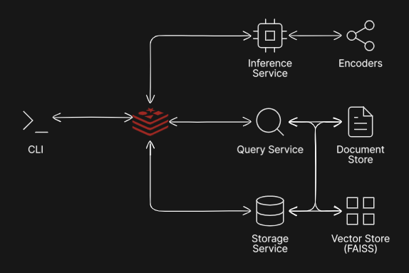

# ImgFlow

A modular event-driven image retrieval system for semantic image ingestion, annotation, storage, and vector-based search via FAISS.

## System Overview

`ImgFlow` provides a complete pipeline for processing and retrieving images using multimodal embeddings:

- Submit images through an interactive CLI
- Generate semantic annotations and embeddings using CLIP
- Persist annotations and embeddings to shared storage
- Search stored images using natural language queries
- Retrieve top-k semantically similar images ranked by vector similarity

The system is built around asynchronous microservice-style components communicating through Redis pub/sub.

## System Design

<p align="center">
  
</p>

The system is organized as an event-driven pipeline.

The CLI serves as the user-facing entry point and publishes events to Redis.

Uploaded images are first sent to the Inference Service, which runs CLIP-based inference to generate semantic tags and image embeddings.

The Storage Service receives inference outputs and persists (1) image annotations/metadata to the Document Store and (2) vector embeddings to the Vector Store.

The Query Service handles natural language retrieval requests by encoding user text queries into CLIP text embeddings, performing nearest-neighbor similarity search over the vector store, and returning ranked results.

Redis acts as the communication backbone between all services, enabling loose coupling between pipeline stages via pub/sub.

## Project Structure

```text
src/
├── broker/             # Redis pub/sub broker wrapper
├── cli/                # Interactive command line interface
├── events/             # Event schemas + topic definitions
├── inference/          # CLIP backend + label definitions
├── services/           # Inference, storage, and query services
├── stores/             # Persistent document/vector storage

tests/
├── broker/             # Broker unit tests
├── events/             # Event tests
├── services/           # Service tests
├── stores/             # Store tests
```

## Core Components

### CLI
Interactive interface for:
- uploading images
- issuing semantic text queries
- viewing retrieval results/errors

### Inference Service
Processes uploaded images by:
- generating semantic tags
- generating normalized CLIP embeddings

### Storage Service
Persists inference results by storing:
- annotation metadata in JSON document storage
- vector embeddings in FAISS index storage

### Query Service
Handles natural language retrieval by:
- encoding text query into CLIP embedding
- searching vector store for nearest matches
- returning ranked top-k results

## Storage Layer

### Document Store
Persistent JSON-backed metadata store containing:

- image ID
- image path
- semantic tags
- model metadata

### Vector Store
Persistent FAISS-backed vector index containing:

- normalized CLIP embeddings
- associated image IDs

## How to Run

### 1. Install dependencies

```bash
pip install -r requirements.txt
```

### 2. Start Redis

```bash
docker compose up -d
```

### 3. Start Services

Run each service in a separate terminal:

```bash
python -m src.services.inference_service
python -m src.services.storage_service
python -m src.services.query_service
```

### 4. Start CLI

```bash
python -m src.cli.cli
```

## CLI Commands

- `help`   — see all commands  
- `upload` — upload image for inference/storage  
- `query`  — search images using natural language  
- `exit`   — quit  

## Example

```text
> upload images/dog.jpg

> query dog
```

## How to Run Tests

Run all tests:

```bash
pytest
```

## Code Quality

This project uses:

- `flake8` for linting  
- `autopep8` for formatting  
